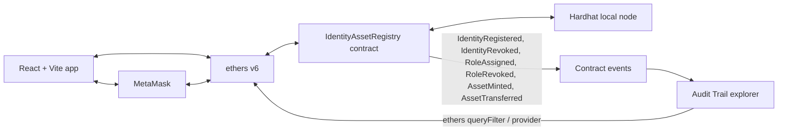

# ChainID Vault

Blockchain platform for decentralized identity, role-based access control and NFT asset ownership with a tamper-proof audit trail. Built for Smart India Hackathon 2026, problem statement SIH26125 (Bharat Electronics Limited).

Organizations need dependable ways to manage identities, permissions, and asset ownership without relying on disconnected records. This project demonstrates a blockchain-based registry where identity and asset changes can be verified on-chain.

## Features

- **DID identities:** register wallets with `did:ethr:<address>` identifiers.
- **Four-role RBAC:** Admin, Manager, Auditor, and User roles.
- **Controlled NFT issuance:** only Admins can mint NFTs, and recipients must be registered active identities.
- **Restricted transfers:** NFT transfers are limited to active registered identities and enforce the User role.
- **On-chain audit trail:** identity, role, and asset changes emit contract events.
- **DID signature login:** verify control of a wallet by signing a nonce-bearing challenge.
- **Audit explorer:** inspect contract events, registered identities, and NFT timelines.
- **Public document verification:** verify a document without a wallet by comparing its file hash against the on-chain SHA-256 fingerprint, with an authentic or tampered result.
- **Governance & Risk dashboard:** review single-admin warnings, frozen assets, role-change activity, and export the audit trail as CSV or JSON.
- **In-app account switching:** switch between every account MetaMask has permitted for the site.

## PS requirement mapping

| PS requirement | How we meet it | Where |
| --- | --- | --- |
| Decentralized identifiers | Registration binds each wallet to a lowercase `did:ethr:<address>` DID stored in its Identity record. | `contracts/IdentityAssetRegistry.sol`: `registerIdentity`, `getIdentity`; test `makes the deployer the initial admin and registers an identity with its DID` |
| NFT ownership | ERC-721 tokens have on-chain metadata and can be enumerated by owner; transfers are restricted to active registered identities with the User role. | `contracts/IdentityAssetRegistry.sol`: `mintAsset`, `getAsset`, `tokensOfOwner`, `_update`; tests `mints assets only by admin to active registered identities and stores metadata`, `allows transfers only between active registered identities` |
| Admin-only minting to identities | `mintAsset` requires the Admin role and an active registered recipient. | `contracts/IdentityAssetRegistry.sol`: `mintAsset`, `_requireActiveIdentity`; test `mints assets only by admin to active registered identities and stores metadata` |
| Smart-contract-enforced RBAC (4 roles) | Admin, Manager, Auditor, and User role hashes are checked by contract functions and transfer rules. | `contracts/IdentityAssetRegistry.sol`: `DEFAULT_ADMIN_ROLE`, `MANAGER_ROLE`, `AUDITOR_ROLE`, `USER_ROLE`, `assignRole`, `revokeRole`, `getRoles`; tests `allows a manager to register users but not assign additional roles`, `allows auditors to read registry data and audit events without write access`, `assigns and revokes roles with audit events and exposes them through getRoles` |
| Immutable audit trail | State changes emit actor/timestamp events; deployed contract logs are read into the audit view. | `contracts/IdentityAssetRegistry.sol`: `IdentityRegistered`, `IdentityRevoked`, `RoleAssigned`, `RoleRevoked`, `AssetMinted`, `AssetTransferred`; tests `assigns and revokes roles with audit events and exposes them through getRoles`, `emits actor and timestamp audit events for ERC721 approval state changes` |
| Cryptographic proof login | The app signs a nonce-bearing DID challenge and verifies the signature recovers the connected wallet. | `frontend/src/App.tsx`: `signInWithDid`, `verifyMessage`; no dedicated contract test (signature verification is frontend behavior) |
| Tamper-proof history | The Audit Trail reads contract logs from block 0 and renders events with their block timestamps and transaction hashes. | `frontend/src/components/AuditTrail.tsx`: `contract.queryFilter`; `contracts/IdentityAssetRegistry.sol`: audit events; test `allows auditors to read registry data and audit events without write access` |

## Security and design decisions

- OpenZeppelin v5 `AccessControl` and `ERC721` provide the role and token base contracts.
- Last-admin lockout protection prevents removal or renunciation of the final Admin.
- Revoked identities are blocked from receiving NFTs, transferring NFTs, and performing role-restricted actions.
- Registry state changes emit events, including identity, role, asset, transfer, and approval changes.
- The app stores no private keys; signing and transactions are requested from MetaMask.
- Role and identity permissions are enforced by the smart contract, not trusted to frontend visibility or role labels.

## Architecture



## Tech stack

- Solidity 0.8.x and OpenZeppelin Contracts v5
- Hardhat 3, Mocha, and ethers v6
- React, Vite, and TypeScript
- MetaMask on the local Hardhat network
- Plain CSS for the responsive frontend

## Local setup and demo

Run these steps in order. Keep the Hardhat node running in its own terminal while deploying and using the app.

1. Install root dependencies from the repository root:

   ```sh
   npm install
   ```

2. Install frontend dependencies:

   ```sh
   cd frontend
   npm install
   cd ..
   ```

3. Start the local Hardhat node in a terminal and leave it running:

   ```sh
   npm run node
   ```

4. In a second terminal at the repository root, deploy and seed the contract:

   ```sh
   npm run deploy:local
   ```

5. In another terminal, start the frontend:

   ```sh
   cd frontend && npm run dev
   ```

   Open the URL printed by Vite. `predev` syncs the deployment address and ABI into the frontend.

6. Add the local network to MetaMask:

   | Setting | Value |
   | --- | --- |
   | Network name | Hardhat Local |
   | RPC URL | `http://127.0.0.1:8545` |
   | Chain ID | `31337` |
   | Currency symbol | `ETH` |

7. Import demo accounts **#0–#4** into MetaMask using the private keys printed by the local Hardhat node. These are public development-only keys; never use them on a public network or with real funds.

### Seeded demo accounts

Addresses are read from [`deployments/localhost.json`](./deployments/localhost.json). Seeded roles are shown below; every registered identity also receives the User role at registration.

| Demo account | Address | Seeded role(s) |
| --- | --- | --- |
| Admin (#0) | `0xf39Fd6e51aad88F6F4ce6aB8827279cffFb92266` | Admin, User |
| Manager (#1) | `0x70997970C51812dc3A010C7d01b50e0d17dc79C8` | Manager, User |
| Auditor (#2) | `0x3C44CdDdB6a900fa2b585dd299e03d12FA4293BC` | Auditor, User |
| Alice (#3) | `0x90F79bf6EB2c4f870365E785982E1f101E93b906` | User |
| Bob (#4) | `0x15d34AAf54267DB7D7c367839AAf71A00a2C6A65` | User |

### Seeded demo assets

All demo records below are fictional and are provided as demo data only:

| Token ID | Asset record | Description | Seeded custody |
| --- | --- | --- | --- |
| #1 | Radar Module RM-2041 Test Certificate | Factory acceptance test record for a radar subsystem batch (demo data) | Minted to Alice, then transferred to Bob |
| #2 | Test Equipment Calibration Certificate | Calibration record for precision test equipment (demo data) | Alice |
| #3 | Approved Vendor Qualification | Qualification certificate for an approved component supplier (demo data) | Bob |

## Document verification (unique feature)

Asset descriptions can include a document fingerprint suffix in the format ` | sha256:<hex>`, where `<hex>` is the lowercase, 64-character SHA-256 digest without a `0x` prefix. The issuance form hashes an optional attached file in the browser; only that fingerprint is appended to the on-chain description, and the document itself never leaves the browser. The public Verify page reads the record and custody history without a wallet, and compares a selected local file against the recorded fingerprint. Dashboard assets include a shareable verification link.

To try the seeded demo:

1. Start the local node, deploy and seed the registry, and run the frontend as described above.
2. Open **Verify** in the app or visit `http://localhost:5173/#/verify/1`.
3. Verify token `1` and drop `demo-files/Radar Module RM-2041 Test Certificate.txt` onto the page; it should report **AUTHENTIC**.
4. Drop `demo-files/radar-module-test-certificate-TAMPERED.txt`; the changed numeric value should report **TAMPERED**.
5. Try tokens `2` and `3` with their matching files in `demo-files/`.

The fingerprint is stored in the description only for this prototype. A production implementation would use a dedicated `bytes32` document-hash field in the contract (a contract change, not done in this prototype).

### What each role can do

| Role | Dashboard description | Capabilities |
| --- | --- | --- |
| Admin | Security Administrator | Register and revoke identities; assign and revoke roles; mint NFTs to active registered identities; read registry data. The last Admin cannot be removed. |
| Manager | Unit Manager | Register identities; read registry data. Does not receive Admin write permissions. |
| Auditor | Quality & Vigilance Auditor | Read registry data and the audit trail; no write permissions. |
| User | Engineer / Vendor | Hold NFTs and transfer owned NFTs to active registered identities. |

## Use case: Bharat Electronics Limited (BEL)

- **Component provenance:** preserve component batch provenance alongside the Radar Module RM-2041 factory acceptance test certificate.
- **Calibration records:** issue traceable calibration records for precision test equipment.
- **Vendor qualification:** associate approved component suppliers with on-chain qualification certificate records.
- **Role-based access and audit:** restrict registry operations by role while giving auditors a tamper-proof trail of identity, role, and asset events.

All demo accounts, names, and asset records in this prototype are fictional. They do not represent actual BEL people, equipment, suppliers, or records.

## Production roadmap (not implemented in this prototype)

- Deploy to a permissioned or private network.
- Store documents off-chain and put only their cryptographic hashes on-chain.
- Integrate enterprise SSO and enterprise DID systems.
- Add secure key management and hardware-backed signing.
- Mainnet-style gas is not required for the local prototype.

## Known limitations

- Auditor is a read-only role. Read methods are public on-chain, and all action panels remain visible after DID sign-in so unauthorized write attempts demonstrate contract-enforced permissions.
- Revoked identities cannot be re-activated; register each wallet only once.
- This setup targets the local Hardhat network only.
- The Verify page reads from a local node at `127.0.0.1:8545`; verification links work only on the same machine.
- Document fingerprints are stored in the asset description text. A production version would use a dedicated contract field.
- DIDs use the `did:ethr`-style address format and have no DID resolver.

## Tests and checks

From the repository root, run the Hardhat tests:

```sh
npx hardhat test
```

Build and lint the frontend from its directory:

```sh
cd frontend
npm run build
npm run lint
```
