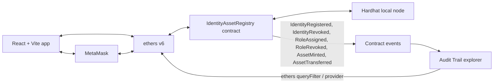

# SIH26125 — Identity & Asset Registry

Organizations need dependable ways to manage identities, permissions, and asset ownership without relying on disconnected records. This project demonstrates a blockchain-based registry where identity and asset changes can be verified on-chain.

## Features

- **DID identities:** register wallets with `did:ethr:<address>` identifiers.
- **Four-role RBAC:** Admin, Manager, Auditor, and User roles.
- **Controlled NFT issuance:** only Admins can mint NFTs, and recipients must be registered active identities.
- **Restricted transfers:** NFT transfers are limited to active registered identities and enforce the User role.
- **On-chain audit trail:** identity, role, and asset changes emit contract events.
- **DID signature login:** verify control of a wallet by signing a nonce-bearing challenge.
- **Audit explorer:** inspect contract events, registered identities, and NFT timelines.

## Architecture



## Tech stack

- Solidity 0.8.x and OpenZeppelin Contracts v5
- Hardhat 3, Mocha, and ethers v6
- React, Vite, and TypeScript
- MetaMask on the local Hardhat network
- Plain CSS for the responsive frontend

## Local setup and demo

Run these steps in order. Keep the Hardhat node running in its own terminal while deploying and using the app.

1. Install root dependencies from the repository root:

   ```sh
   npm install
   ```

2. Install frontend dependencies:

   ```sh
   cd frontend
   npm install
   cd ..
   ```

3. Start the local Hardhat node in a terminal and leave it running:

   ```sh
   npm run node
   ```

4. In a second terminal at the repository root, deploy and seed the contract:

   ```sh
   npm run deploy:local
   ```

5. In another terminal, start the frontend:

   ```sh
   cd frontend && npm run dev
   ```

   Open the URL printed by Vite. `predev` syncs the deployment address and ABI into the frontend.

6. Add the local network to MetaMask:

   | Setting | Value |
   | --- | --- |
   | Network name | Hardhat Local |
   | RPC URL | `http://127.0.0.1:8545` |
   | Chain ID | `31337` |
   | Currency symbol | `ETH` |

7. Import demo accounts **#0–#4** into MetaMask using the private keys printed by the local Hardhat node. These are public development-only keys; never use them on a public network or with real funds.

### Seeded demo accounts

Addresses are read from [`deployments/localhost.json`](./deployments/localhost.json). Seeded roles are shown below; every registered identity also receives the User role at registration.

| Demo account | Address | Seeded role(s) |
| --- | --- | --- |
| Admin (#0) | `0xf39Fd6e51aad88F6F4ce6aB8827279cffFb92266` | Admin, User |
| Manager (#1) | `0x70997970C51812dc3A010C7d01b50e0d17dc79C8` | Manager, User |
| Auditor (#2) | `0x3C44CdDdB6a900fa2b585dd299e03d12FA4293BC` | Auditor, User |
| Alice (#3) | `0x90F79bf6EB2c4f870365E785982E1f101E93b906` | User |
| Bob (#4) | `0x15d34AAf54267DB7D7c367839AAf71A00a2C6A65` | User |

### What each role can do

| Role | Capabilities |
| --- | --- |
| Admin | Register and revoke identities; assign and revoke roles; mint NFTs to active registered identities; read registry data. The last Admin cannot be removed. |
| Manager | Register identities; read registry data. Does not receive Admin write permissions. |
| Auditor | Read registry data and the audit trail; no write permissions. |
| User | Hold NFTs and transfer owned NFTs to active registered identities. |

## Known limitations

- Auditor is a read-only role. Read methods are public on-chain, and all action panels remain visible after DID sign-in so unauthorized write attempts demonstrate contract-enforced permissions.
- Revoked identities cannot be re-activated; register each wallet only once.
- This setup targets the local Hardhat network only.
- DIDs use the `did:ethr`-style address format and have no DID resolver.

## Tests and checks

From the repository root, run the Hardhat tests:

```sh
npx hardhat test
```

Build and lint the frontend from its directory:

```sh
cd frontend
npm run build
npm run lint
```
